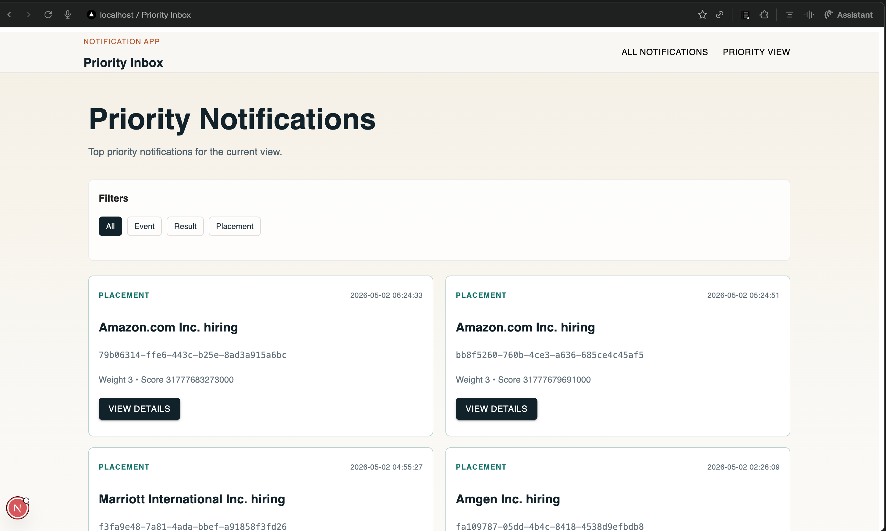

# Priority Inbox

 The goal of this project is to process incoming notifications and ensure that the most important and recent ones are surfaced first.

##  Overview

The system fetches notifications from a protected API and determines priority based on:

* Type of notification (Placement > Result > Event)
* Recency (latest notifications are more important)

The top notifications are then selected and displayed.

---

##  Approach

1. Fetched notifications using the provided API with authentication.
2. Assigned weights to each notification type:

   * Placement → High priority
   * Result → Medium priority
   * Event → Low priority
3. Combined type weight and timestamp to calculate a priority score.
4. Sorted notifications based on this score and selected the top 10.

---

## Efficiency Consideration

To handle continuous incoming notifications efficiently:

* A **Min Heap (size = 10)** approach can be used.
* This ensures we always maintain the top 10 notifications without sorting the entire dataset repeatedly.
* Time Complexity: **O(n log k)**

---

##  Tech Stack

* Node.js / JavaScript
* REST API integration
* Basic data structures (sorting / heap concept)

---

##  Output



* Top 10 prioritized notifications
* API response handling

---

## 📂 Project Structure

```
your-roll-number/
├── README.md
├── .env.local
├── logging_middleware/
├── .gitignore
├── notification_system_design.md
├── notification_app_be/
├── notification_app_fe/
└── package.json

```

---


##  Conclusion

This implementation ensures that users always see the most relevant notifications first, even when the volume of incoming data is high.
